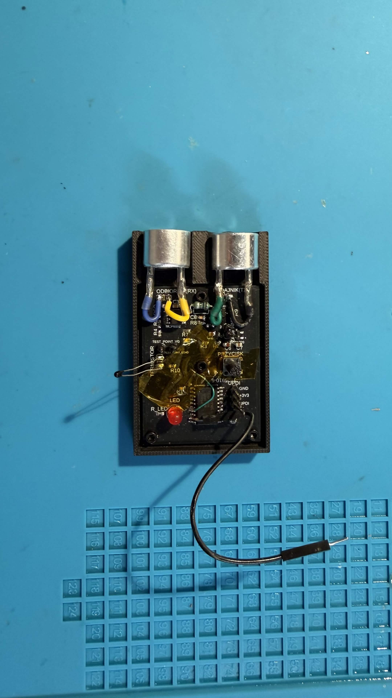
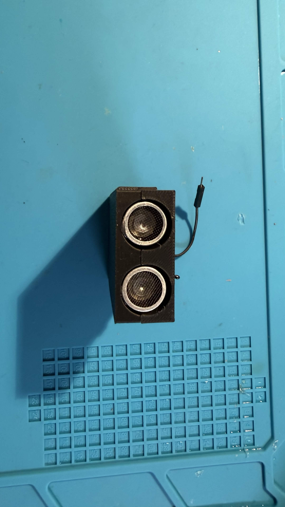

# Bezkontaktowy miernik odległości (ultradźwiękowy)

Miernik odległości na mikrokontrolerze **ATtiny1616**, mierzący dystans do obiektu
ultradźwiękami **40 kHz** w zakresie **10–50 cm**. Projekt na ogólnopolski konkurs
**„Wygraj Indeks WETI 2026"** (Politechnika Gdańska).

Metoda hybrydowa **Pulse-Phase Ranging**: zgrubny pomiar czasu przelotu (ToF) z obwiedni
echa + docinanie fazą nośnej (filtr Goertzela), z kompensacją temperatury termistorem NTC.
Firmware napisany **w czystym AVR-GCC, na rejestrach (bez Arduino)**.

<p align="center">
  
  
</p>

## Parametry (zmierzone)

| Parametr | Wartość |
|---|---|
| Zakres pomiaru | 10–50 cm (karton 20×20 cm) |
| Błąd RMSE | **≈ 2,4 mm** (35 odczytów, kalibracja liniowa) |
| Pobór mocy (spoczynek) | **0,18 mA @ 5 V = 0,9 mW** |
| Koszt elementów | 43,73 PLN |
| Zasilanie | 5 V (LDO MCP1700 → 3,3 V) |
| Zegar | 10 MHz (wewn. OSC20M / 2) |

## Jak to działa

1. **Nadawanie** — mikrokontroler generuje paczkę 40 kHz (dokładny rezonans przetwornika)
   na pinie PB0, wzmacnianą tranzystorem BC817.
2. **Odbiór** — echo wzmacnia dwustopniowy tor na MCP6002 (filtr pasmowy ~40 kHz),
   bramkowany P-MOSFET-em (BSS84) dla oszczędności energii.
3. **ToF** — ADC szybko próbkuje obwiednię echa (8-bit, ~115 ksps); początek echa
   (*onset*, próg 40 % szczytu z interpolacją) daje czas przelotu mierzony licznikiem
   TCB0 (100 ns/takt). Seria 9 strzałów → mediana + odrzucanie outlierów (MAD).
4. **Faza** — filtr Goertzela na buforze próbek wyznacza fazę nośnej (uśrednianą po
   pingach, z miarą spójności PLV) do dociągnięcia wyniku do siatki λ/2 ≈ 4,3 mm.
5. **Temperatura** — NTC 10 kΩ (model Beta) koryguje prędkość dźwięku c(T) = 331,3 + 0,606·T.
6. **Energia** — między pomiarami MCU śpi w trybie Standby, budzony z RTC/PIT;
   tor analogowy zasilany tylko na czas pomiaru.

Dostępna jest też **2-punktowa kalibracja polowa** zapisywana w EEPROM (wejście:
przytrzymanie przycisku przy starcie).

## Struktura repozytorium

| Katalog / plik | Zawartość |
|---|---|
| `firmware/` | Kod źródłowy (`main.c`), plik wynikowy (`main.hex`), `Makefile` |
| `dokumentacja-etap2/` | Dokumentacja prototypu (LaTeX + PDF), zdjęcia w `foto/` |
| `dokumentacja-etap1/` | Projekt koncepcyjny (teza, schemat, PCB, symulacje LTspice) |
| `deliverables/` | Paczka konkursowa (firmware, CAD, Gerber) |
| `obudowa/` | Modele obudowy (druk 3D) |
| `WETI_Kacper_Popko_Etap2.zip` | Gotowa paczka do oddania |

## Budowanie i wgranie firmware

Wymagane: `avr-gcc`, `avrdude`, programator UPDI (np. SerialUPDI / CP2102 albo
Arduino z jtag2updi).

```bash
cd firmware
make
avrdude -c jtag2updi -p attiny1616 -P COMx -b 115200 -U flash:w:main.hex:i
```

Wynik pomiaru wychodzi przez USART (pin PB2, 115200 8N1):
```
#1 D=203mm (Dc=204 ph=240.5 plv=98 T=22.6C 9/9 pk=18)
```
`D` — odległość po fuzji fazowej, `Dc` — zgrubna (ToF), `ph` — faza, `plv` — spójność
fazy, `T` — temperatura, `pk` — amplituda echa.

## Sprzęt

ATtiny1616-SN · MCP6002 (wzmacniacz) · MCP1700 (LDO 3,3 V) · BC817 (driver TX) ·
BSS84 (bramkowanie toru) · NTC 10 kΩ · para przetworników US 40 kHz · PCB 2-warstwowe ~49×36 mm.

## Autor

Kacper Popko — projekt konkursowy „Wygraj Indeks WETI 2026".

## Licencja

© 2026 Kacper Popko. Projekt (sprzęt, oprogramowanie, dokumentacja) jest
**open source** na licencji
**[CC BY-NC-SA 4.0](https://creativecommons.org/licenses/by-nc-sa/4.0/deed.pl)**:

- ✅ możesz **kopiować, używać i edytować / rozwijać** projekt,
- ✏️ przeróbki musisz udostępniać **na tej samej licencji** (SA),
- 👤 musisz **podać autora** (Kacper Popko) (BY),
- 🚫 **nie wolno wykorzystywać komercyjnie** — w tym sprzedawać urządzenia,
  płytek, oprogramowania ani odpłatnych usług (NC).

Szczegóły w pliku [`LICENSE`](LICENSE).
